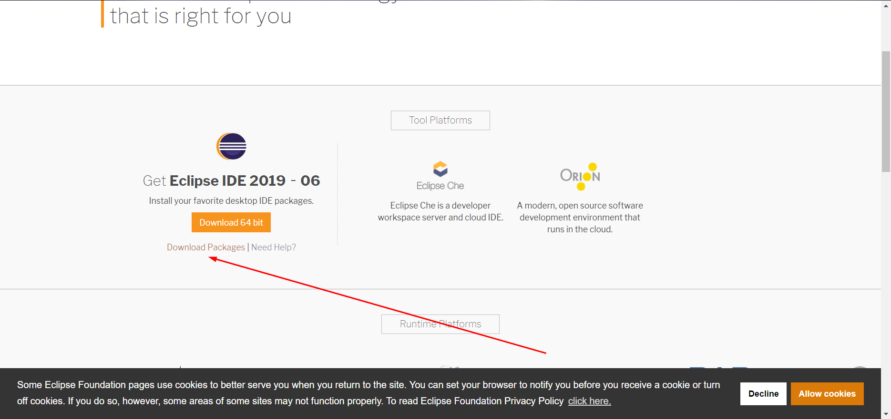
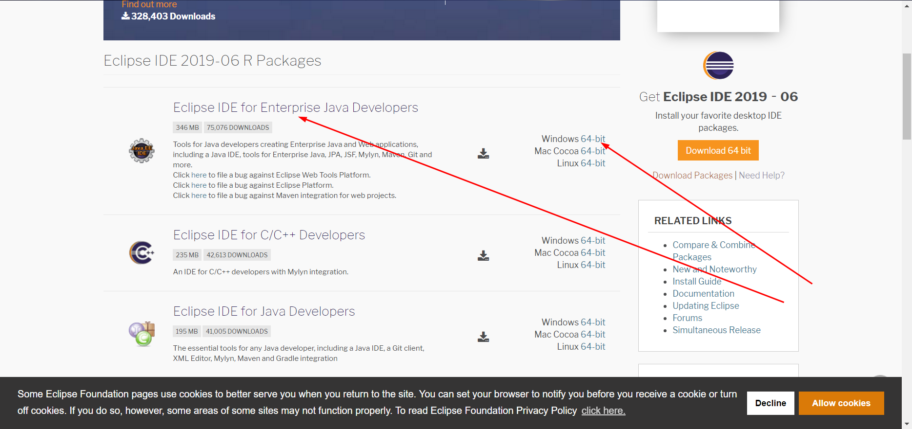
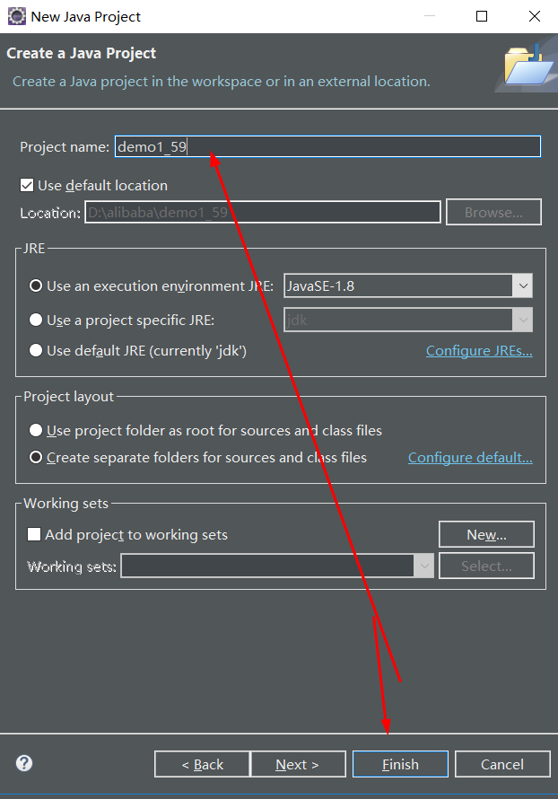
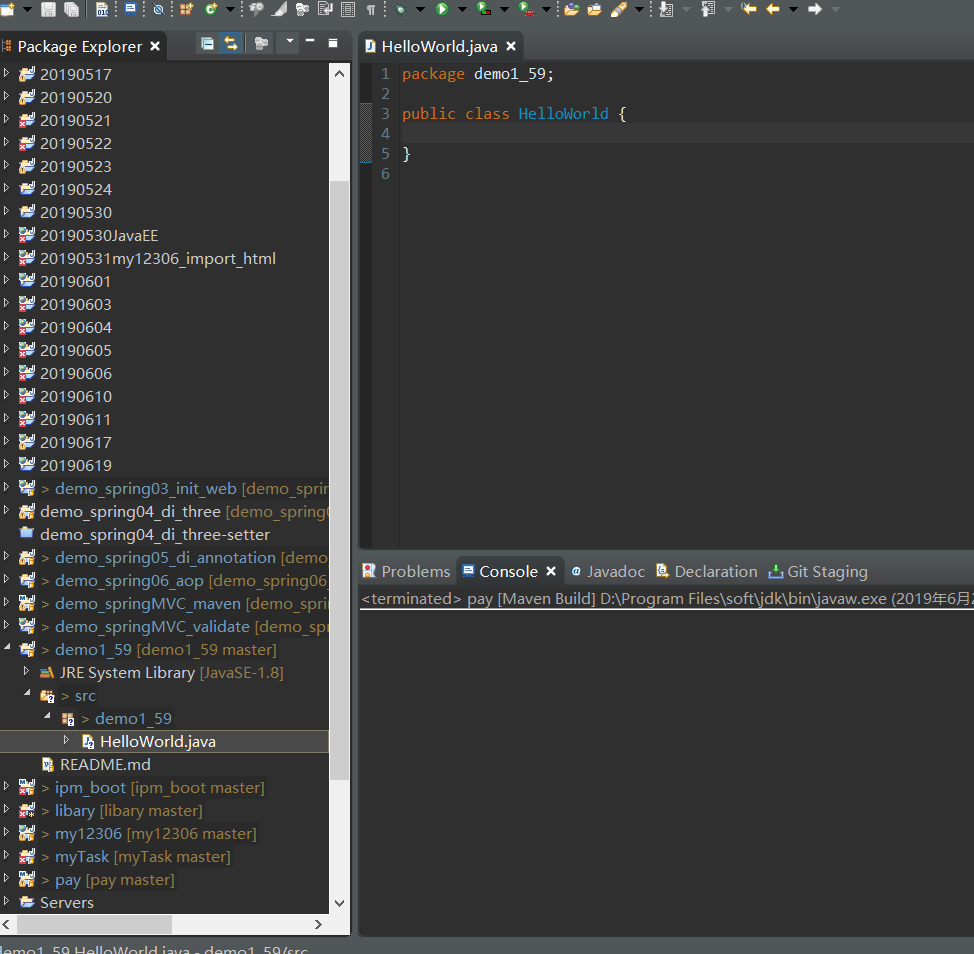
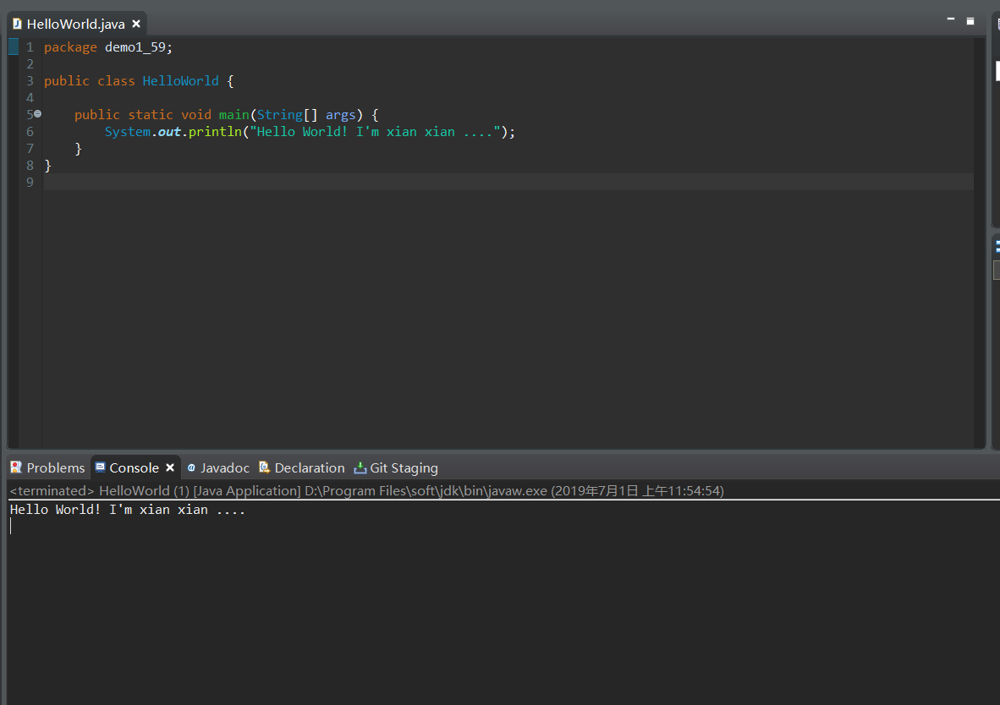
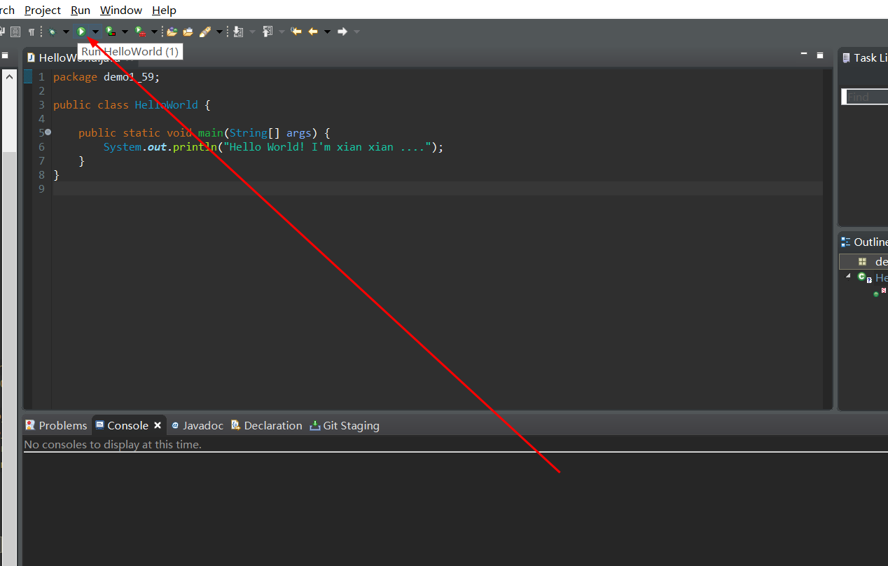

# 76-Java安装Eclipse并创建第一个HelloWorld.md

1. 首先确定已经安装Java系统环境，若未安装，请参考博客[Java环境windows搭建](https://www.jianshu.com/p/433f70bae3cb)

2. 访问[Eclipse官网](https://www.eclipse.org/)






3. 下载完成直接发送快捷方式到桌面即可,Eclipse安装jre之类的全都省略咯。。

4. 打开Eclipse 创建一个工程名 new ---> Java project



5. src右键新建类 **HelloWorld**.java



```
package demo1_59;

public class HelloWorld {
	
	public static void main(String[] args) {
		System.out.println("Hello World! I'm xian xian ....");
	}
}
```
6. 右键 ---> Run As ---> 1 Java Application,如图所示第一个HelloWorld程序运行成功咯。。



7. 另一种运行方式，点击如下图所示按钮也能运行。




**以就就是我关于 *Java安装Eclipse并创建第一个HelloWorld*  知识点的整理与总结的全部内容，[另附源码](https://github.com/javaobjects/demo1_59)**

==================================================================
#### 分割线
==================================================================

**博主为咯学编程：父母不同意学编程，现已断绝关系;恋人不同意学编程，现已分手;亲戚不同意学编程，现已断绝来往;老板不同意学编程,现已失业三十年。。。。。。如果此博文有帮到你欢迎打赏，金额不限。。。**

